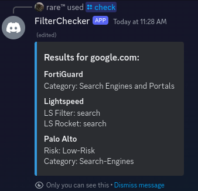
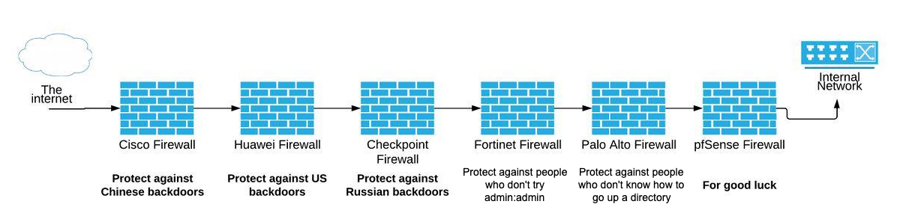

</img>
# FilterChecker V2
The most powerful unblocked link checker, supporting these filters:
* Lightspeed Systems
* Palo Alto Systems
* FortiGuard

<br>

Also comes with **many** QoL (quality of life) features, including:
* Ability to be used as a User App for even better convenience
* Built-In API that can be enabled (pass `--web <port>`, default port is 10000)
* Check all filters, or just a single filter
* Made in TypeScript, not Python, so therefore type friendly
* Showing results ephemerally is now an option
* More detailed and user-friendly outputs

## Setup
Setting up FilterChecker V2 is as easy as pie! <br >
Assuming you already cloned the repo, and installed [Bun](https://bun.sh):
1. Install packages using `bun i`
2. Put your bot token in your `.env` file, use `example.env` as an example
3. Start the bot with `bun run start`, if you wish to run the API alongside, you can turn your command into `bun run start --web`, and if you want to specify a custom port, `bun run start --web 8080`

## API Docs
**GET** `/` or `/ping`: Healthcheck, should always respond with `OK`.

----

**GET/POST** `/request/[url]/results.txt`: 
* If a GET request was made, it will show a FilterChecker report of all filters
* If a POST reqest was made, you'll have an option to specify what filter in a JSON format, the options are:
  * `lightspeed` or `ls` for Lightspeed
  * `fortiguard` or `forti` for FortiGuard
  * `palo` or `paloalto` for Palo Alto

**POST** request example:
`{"filter":"lightspeed"}` <br>
**POST** request example response:
```
FilterChecker Report for youtu.be:

Lightspeed:
LS Filter: education.videos
LS Rocket: education.videos

```

**GET** request example response:
```
FilterChecker Report for youtu.be:

FortiGuard:
Category: Streaming Media and Download

Lightspeed:
LS Filter: education.videos
LS Rocket: education.videos

Palo Alto:
Risk: Low-Risk
Category: Streaming-Media
```

----

**GET/POST** `/request/[url]/results.json`: 
* If a GET request was made, it will show a FilterChecker report of all filters in a JSON format.

* If a POST reqest was made, you'll have an option to specify what filter in a JSON format, the options are:
  * `lightspeed` or `ls` for Lightspeed
  * `fortiguard` or `forti` for FortiGuard
  * `palo` or `paloalto` for Palo Alto

**POST** request example:
`{"filter":"lightspeed"}` <br>
**POST** request example response:
```json
{
    "lightspeed": [
        "education.videos",
        "education.videos"
    ]
}
```
**GET** request example response:
```json
{
  "fortiguard": "Streaming Media and Download",
  "lightspeed": [
    "education.videos",
    "education.videos"
  ],
  "paloalto": [
    "Streaming-Media",
    "Low-Risk"
  ]
}
```

----

